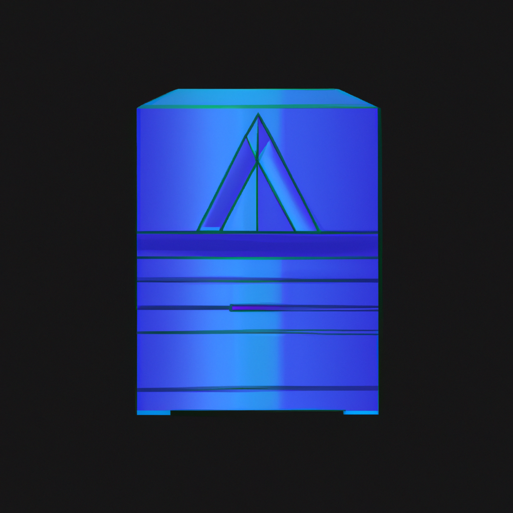

<div align="center">
  
  
  # 🧊 Freeze Guard
  ### Professional State Management Application
  
  <p align="center">
    <em>A modern desktop application for freezing and restoring partition and folder states</em>
  </p>
  
  <p align="center">
    
    
    
    
  </p>
  
  <p align="center">
    
    
    
  </p>
</div>

---

## ✨ Features

<div align="center">
  <table>
    <tr>
      <td align="center">
        
        <br><strong>Partition & Folder Freezing</strong>
        <br><em>Create snapshots of entire partitions or specific folders</em>
      </td>
      <td align="center">
        
        <br><strong>Real-time Monitoring</strong>
        <br><em>Track changes to frozen targets in real-time</em>
      </td>
      <td align="center">
        
        <br><strong>Modern UI</strong>
        <br><em>Beautiful, responsive interface with Material Design</em>
      </td>
    </tr>
    <tr>
      <td align="center">
        
        <br><strong>Professional Architecture</strong>
        <br><em>Built with industry-standard patterns and practices</em>
      </td>
      <td align="center">
        
        <br><strong>Performance Optimized</strong>
        <br><em>Efficient snapshot creation and restoration</em>
      </td>
      <td align="center">
        
        <br><strong>Secure</strong>
        <br><em>Optional encryption for snapshots</em>
      </td>
    </tr>
  </table>
</div>

## Technology Stack

- **Frontend**: React 18 + TypeScript + Material-UI
- **Backend**: Electron + Node.js
- **State Management**: Redux Toolkit
- **Animations**: Framer Motion
- **File Watching**: Chokidar
- **Configuration**: Electron Store
- **Build System**: Electron Builder

## Architecture

The application follows professional software development patterns:

- **Clean Architecture**: Separation of concerns with distinct layers
- **Repository Pattern**: Abstracted data access layer
- **Observer Pattern**: Event-driven architecture for real-time updates
- **Command Pattern**: Encapsulated operations for undo/redo functionality
- **Factory Pattern**: Service instantiation and dependency injection
- **Singleton Pattern**: Configuration and logging services

## Project Structure

```
freeze_app/
├── electron/                 # Electron main process
│   ├── main.ts              # Application entry point
│   ├── preload.ts           # Secure IPC bridge
│   ├── services/            # Core business logic
│   │   ├── FreezeService.ts # Main freeze/restore operations
│   │   ├── FileSystemService.ts # File system operations
│   │   └── ConfigService.ts # Configuration management
│   ├── utils/               # Utility classes
│   │   └── Logger.ts        # Professional logging system
│   └── types/               # TypeScript definitions
├── src/                     # React frontend
│   ├── components/          # React components
│   │   ├── layout/          # Layout components
│   │   ├── views/           # Main view components
│   │   └── common/          # Reusable components
│   ├── store/               # Redux store and slices
│   ├── hooks/               # Custom React hooks
│   ├── theme/               # Material-UI theme
│   └── types/               # Frontend type definitions
├── public/                  # Static assets
└── build/                   # Production build output
```

## 📋 Prerequisites

- Node.js 16+ 
- npm or yarn
- Git

## 🚀 Quick Start

### Installation

1. **Clone the repository**
   ```bash
   git clone <repository-url>
   cd freeze_app
   ```

2. **Install dependencies**
   ```bash
   npm install
   ```

3. **Development setup**
   ```bash
   # Install development dependencies
   npm install --save-dev
   ```

### 🖥️ Running the Desktop Application

After building the application, you can run it directly using:

```bash
# Run the desktop application
npx electron dist/main.js
```

> **Note**: Make sure you have built the application first using `npm run build` before running this command.

**Alternative methods:**
```bash
# Using npm script (if available)
npm run start:desktop

# Or start in development mode
npm start
```

## 💻 Development

### Running in Development Mode

```bash
# Start the development server
npm start
```

This will:
- Start the React development server on http://localhost:3000
- Launch the Electron application
- Enable hot reloading for both frontend and backend
- Open developer tools automatically

### Building for Production

```bash
# Build the React app
npm run build

# Build the Electron app
npm run build:electron

# Create distributable packages
npm run dist
```

### 📜 Available Scripts

| Script | Description |
|--------|-------------|
| `npm start` | Start development environment |
| `npm run build` | Build for production |
| `npm run build:renderer` | Build React app only |
| `npm run build:electron` | Build Electron main process only |
| `npm run dist` | Create distributable packages |
| `npm test` | Run tests |

## ⚙️ Configuration

The application uses Electron Store for configuration management. Settings are automatically persisted and include:

- Snapshot directory location
- Performance optimization settings
- UI theme preferences
- Exclude patterns for file monitoring
- Security settings (encryption, etc.)

## 🔧 Core Services

### 🧊 FreezeService
Manages the core freeze/restore functionality:
- Target management (add, remove, monitor)
- Snapshot creation and restoration
- Real-time change tracking
- Operation progress reporting

### 📁 FileSystemService
Handles all file system operations:
- File watching and change detection
- Drive enumeration
- Path validation
- File operations (copy, move, delete)

### ⚙️ ConfigService
Manages application configuration:
- Settings persistence
- Validation and defaults
- Performance mode adjustments
- Import/export functionality

## 🔒 Security Features

- **🛡️ Sandboxed Renderer**: React app runs in a secure sandbox
- **🔐 Context Isolation**: Secure IPC communication
- **🚫 No Node Integration**: Frontend has no direct Node.js access
- **🔑 Encrypted Snapshots**: Optional AES-256 encryption
- **📋 Audit Logging**: Complete operation audit trail

## ⚡ Performance Optimizations

- **📈 Incremental Snapshots**: Only store changes, not full copies
- **🗜️ Compression**: Optional snapshot compression
- **⚡ Concurrent Operations**: Configurable parallel processing
- **🧠 Memory Management**: Efficient memory usage patterns
- **🔄 Background Processing**: Non-blocking operations

## 🌐 Platform Support

### 🪟 Windows
- Full partition support (NTFS, FAT32, exFAT)
- Drive enumeration
- Windows-specific optimizations

### 🍎 macOS
- APFS and HFS+ support
- macOS security compliance
- Native look and feel

### 🐧 Linux
- ext4, Btrfs support
- Standard mount point detection
- Distribution compatibility

## 🔧 Troubleshooting

### ⚠️ Common Issues

1. **🔐 Permission Errors**
   - Run as administrator/root for partition-level operations
   - Check file system permissions

2. **📊 Large File Performance**
   - Adjust performance mode in settings
   - Increase memory allocation
   - Use SSD for snapshot storage

3. **🛡️ Antivirus Conflicts**
   - Add application to antivirus whitelist
   - Exclude snapshot directory from real-time scanning

### 📝 Logging

Logs are stored in:
- **Windows**: `%TEMP%/freeze-guard-logs/`
- **macOS**: `/tmp/freeze-guard-logs/`
- **Linux**: `/tmp/freeze-guard-logs/`

## 🤝 Contributing

1. 🍴 Fork the repository
2. 🌿 Create a feature branch
3. ✨ Make your changes
4. 🧪 Add tests if applicable
5. 📤 Submit a pull request

## 📄 License

This project is licensed under the MIT License - see the LICENSE file for details.

## 💬 Support

For support and questions:
- 📖 Check the documentation
- 🔍 Review the logs for error details
- 🐛 Submit issues on the project repository

## 🗺️ Roadmap

### 📅 Version 1.1
- 🌐 Network drive support
- ⏰ Scheduled automatic freezing
- 🔍 Advanced filtering rules
- ☁️ Cloud backup integration

### 🚀 Version 2.0
- 🏢 Enterprise management features
- 👥 Multi-user support
- 🔌 REST API for automation
- 🧩 Plugin system

---

<div align="center">
  
  <br>
  <strong>🧊 Freeze Guard</strong> - Professional state management for the modern desktop
  <br><br>
  <em>Made with ❤️ by the Freeze Guard Team</em>
</div>